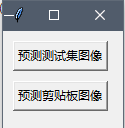
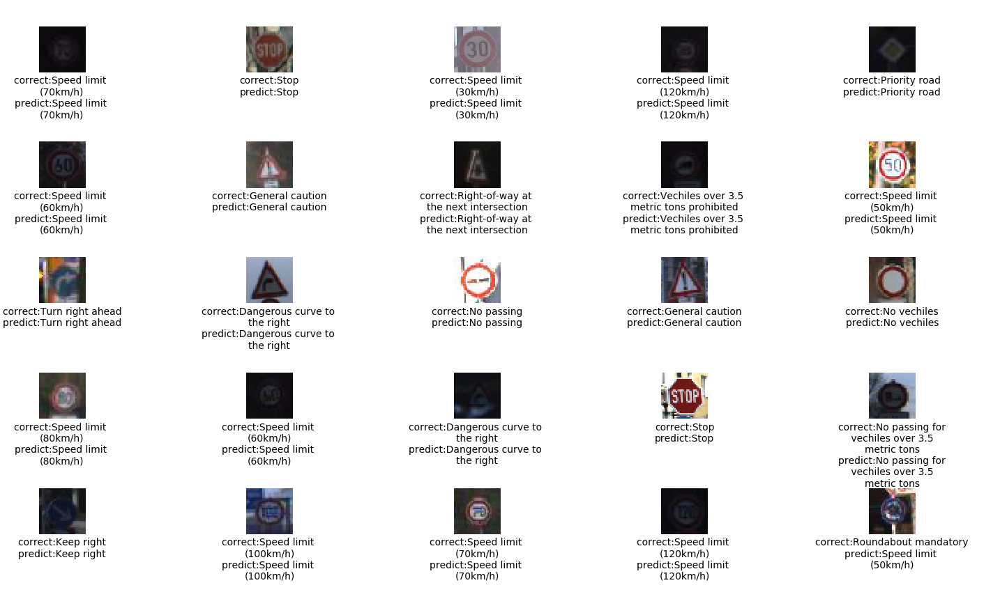
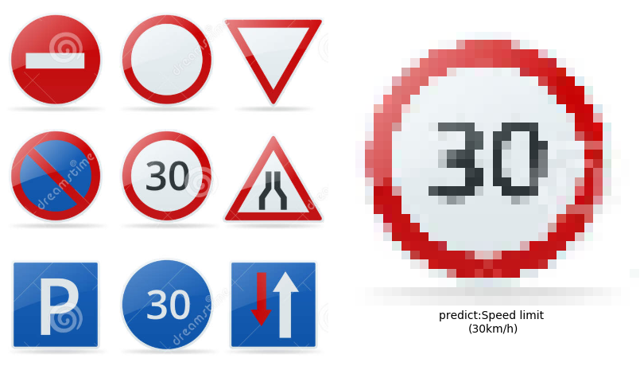
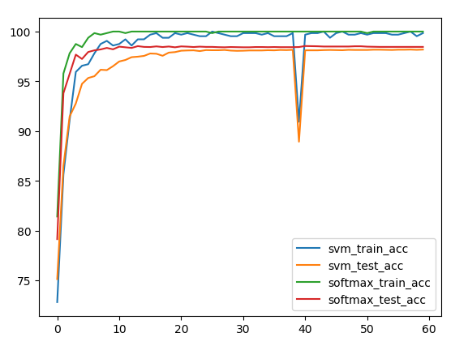
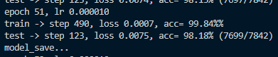
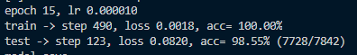
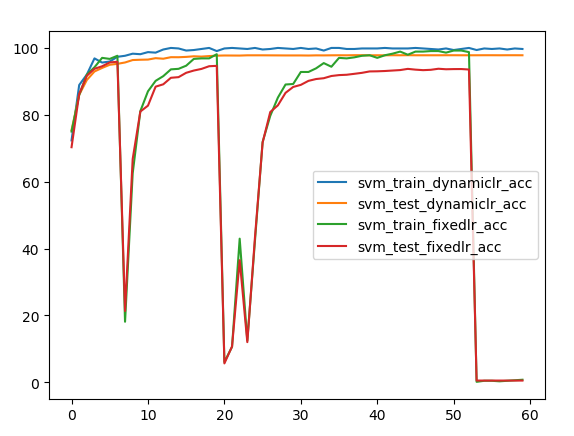
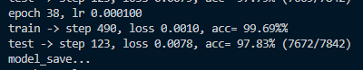
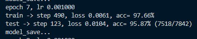

# Numpy Network

学习使用 numpy 构建基础神经网络

## 已实现

* Linear 全连接层
* Conv2D 卷积层
  * 普通卷积
  * 基于 im2col 进行加速卷积
* ReLU
* MaxPool 最大池化
* Flatten 展平层（用于卷积 -> Flatten -> Linear）
* Softmax（只有 softmax，不是 softmax-loss 即 softmax + 交叉熵）
* BatchNorm
* cross-entropy loss 交叉熵损失
* hinge loss 合页损失

## 文件结构

* models 文件夹包含实现的基础网络层以及由基础网络层构建的网络
  * `base_layer.py` 包好基本的网络层的实现
  * `simplenet.py` 目前用的测试网络结构（CNN -> CNN -> Flatten -> Linear -> SVM hinge loss）
* utils 文件夹包含 loss、optimize、dataset 构建等其它功能模块
  * `base_loss.py` 定义了损失函数
    * cross_entropy 交叉熵，用于 softmax
    * hinge_loss 合页损失，用于 SVM
  * `base_optim.py` 定义了优化器
    * 目前就是 weight - lr * grad
  * `general_dataset.py` 定义了数据集的构建和使用
    * GeneralDataset 类可以从符合要求的文件夹中构建数据集，需要文件夹内部符合一定的层级结构（子文件夹为 class，子文件夹的内容为此 class 的所有 image）
    * Mnist 类用于构建 Mnist 数据集，需要指定其目录为 mnist 文件夹
* `classifier.py` 定义分类器类，综合了数据集处理、参数训练、推理等功能
* `main.py` 是主程序
  * 运行 train() 函数训练模型
  * 运行 test() 函数测试模型

## 环境

* numpy==1.16.4
* python==3.7.3

> 不是这个版本应该也能运行

## 使用

* 下载本仓库
* 下载 GTSRB 德国交通标志识别数据集：[数据集地址](https://sid.erda.dk/public/archives/daaeac0d7ce1152aea9b61d9f1e19370/published-archive.html)，把 `classifier.py` 中的数据集地址更换为您下载的数据集的地址（如 `H:\\dataset\\GTSRB\\Image`）
* 运行 `main.py`

```powershell
    python main.py
```

* 在 `main.py` 中更换注释选择训练或测试模式

```python
# train() # 要训练取消注释我
test() # 要测试取消注释我
```

* 默认会使用已经训练完成的正确率为 95.02% 的权重文件进行测试，在弹出的 GUI 中可选择**预测测试集图像**或**预测剪贴板图像**

## 图片示例

* 取消注释 `test()` 函数进入测试模式



* 选择**预测测试集图像**



* 在网上搜索交通标志图片，截图至剪贴板，选择**预测剪贴板图像**



## 一些没做完的实验

### cnn-softmax（使用交叉熵损失）与 cnn-svm（使用合页损失）对比

* 实验变量
  * **两层**卷积神经网络（32 核+64 核），卷积层采用 **BatchNorm 层**以及 **ReLU 激活层**，**两层**线性层，节点数分别为 **3072** 和 **10**

    * 具体结构

      ```
      SimpleNet(
        (block1): ConvBlock(
          (conv): Conv2d(3, 32, kernel_size=(3, 3), stride=(1, 1), padding=(1, 1), bias=False)
          (bn): BatchNorm2d(32, eps=1e-05, momentum=0.1, affine=True, track_running_stats=True)
          (relu): ReLU()
          (pool): MaxPool2d(kernel_size=2, stride=2, padding=0, dilation=1, ceil_mode=False)
        )
        (block2): ConvBlock(
          (conv): Conv2d(32, 64, kernel_size=(3, 3), stride=(1, 1), padding=(1, 1), bias=False)
          (bn): BatchNorm2d(64, eps=1e-05, momentum=0.1, affine=True, track_running_stats=True)
          (relu): ReLU()
          (pool): MaxPool2d(kernel_size=2, stride=2, padding=0, dilation=1, ceil_mode=False)
        )
        (flatten): Flatten()
        (linear1): Linear(in_features=4096, out_features=3072, bias=True)
        (linear_relu): ReLU()
        (linear2): Linear(in_features=3072, out_features=10, bias=True)
      )
      ```

  * 正则损失系数 $reg=0$

  * 优化器选择：**SGD**

  * 训练策略：

    * 前 **20** 个 epoch 采用 $lr=1e-3$，训练时**当测试集正确率大于之前的最高正确率时保存模型**
  * 恢复之前保存的**最高正确率模型**
    
    * 中 **20** 个 epoch 采用 $lr=1e-4$，训练时**当测试集正确率大于之前的最高正确率时保存模型**
  * 恢复之前保存的**最高正确率模型**
    
    * 后 **20** 个 epoch 采用 $lr=1e-5$，训练时**当测试集正确率大于之前的最高正确率时保存模型**
  * 训练完成后保存的模型为此次训练的最终结果，拥有**最高的测试集正确率**
  
  > 一个 epoch 指将**所有**训练集、测试集图片都过一遍
  
  * 数据集：**traffic sign**（**31367** 训练集，**7842** 测试集）
    
  * loss 函数：cnn-svm -> **平方合页损失**（就是论文里的 L2-SVM），cnn-softmax -> **softmax + cross_entropy**
  * **没有**在训练集进行数据增广操作
  
  * **没有**在测试集添加噪声
  
* 实验结果

  * 
  
  > 正确率突降可能是 SGD 冲过头的问题（实验的时候 $lr=1e-3$ 的时候更容易发生，但这里是在 $1e-4$ 的时候发生的），采用保存正确率最高的模型并恢复可以消除其影响
  
  * cnn-svm 最佳正确率: **98.18%**
    * 
  * cnn-softmax 最佳正确率：**98.55%**
    * 
  * cnn-softmax 正确率略高一点

### Regularization Penalty 与 Loss 阶数的选择

* 实验变量
  
  * loss 函数：cnn-svm 分别选用**平方合页损失**与**普通合页损失**
    * **普通合页损失**：$\sum{max(s_i-y+1)}$
    * **平方合页损失**：$\sum{max^2(s_i-y+1)}$
  * reg 参数：对选用不同的 loss 函数的 svm 模型采用不同的 reg 参数进行扫描，扫描范围为 **[0, 1e-9, 1e-6, 1e-5, 5e-5, 7e-5, 1e-4, 5e-4, 1e-3, 5e-3, 1e-2]**
  
* 实验结果

  * | Regularization Penalty |   L1SVM   |   L2SVM   |
    | :--------------------: | :-------: | :-------: |
    |           0            |   98.02   | **98.07** |
    |          1e-9          |   97.54   | **97.78** |
    |          1e-6          |   97.93   |   97.93   |
    |          1e-5          |   97.51   | **97.88** |
    |          5e-5          | **98.00** |   97.66   |
    |          7e-5          |   97.87   | **98.08** |
    |          1e-4          |   97.55   | **97.99** |
    |          5e-4          |   97.46   | **97.99** |
    |          1e-3          |   97.67   | **97.84** |
    |          5e-3          |   96.07   | **96.71** |
    |          1e-2          |   93.27   | **94.28** |

  * 加粗的为较大的值，可以看到 **L2SVM 的测试集正确率普遍高于 L1SVM**，同时**在 reg 为 0 以及 7e-5 时取到峰值**

### 训练策略的选择

* 实验变量
  * 选取不同的训练策略
    * 以 $lr=1e-3$ 训练 **60** 个 epoch
    * 采用**动态学习率**，每 **20** 个 epoch 恢复最好结果并将学习率除以 **10** 后继续训练
* 实验结果
  * 
  * **动态学习率**（dynamiclr）最佳正确率：**97.83%**
    * 
  * **固定学习率**（fixedlr）最佳正确率：**95.87%**
    * 
  * 固定学习率**在一开始也能迅速达到一个不错的正确率，但是后面会开始振荡**（可能是学习率过大导致的冲过头，而如果设置小的固定学习率，则正确率提高速度会很慢，不能在初期迅速增长），**最终正确率不如动态学习率**

## 参考

* cs231n 课程作业
* [Deep Learning using Linear Support Vector Machines](https://arxiv.org/pdf/1306.0239.pdf)